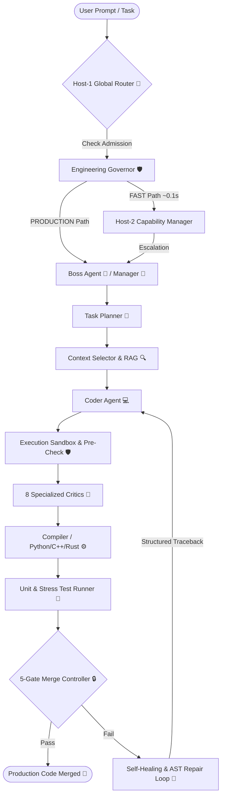
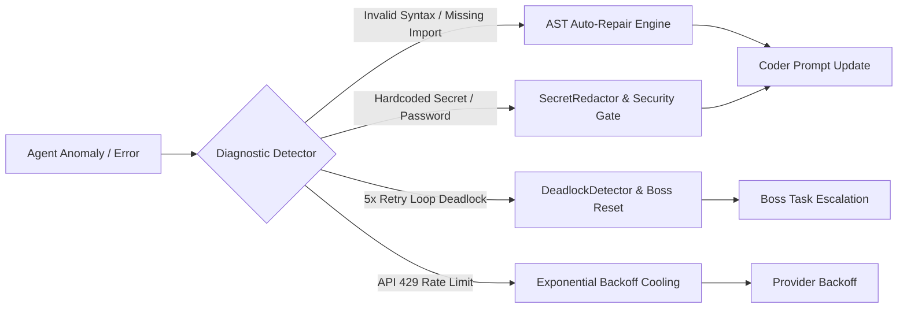

# ⚡ Zymis

[](https://pypi.org/project/zymis/)
[](https://opensource.org/licenses/Apache-2.0)
[](https://pypi.org/project/zymis/)
[](https://github.com/abhinav00anand/zymis)
[](https://github.com/abhinav00anand/zymis)

```text
  _____           _     
 |___  /_   _ _ __ (_)___ 
    / /| | | | '_ \| / __|
   / /_| |_| | | | | \__ \
  /____|\__, |_| |_|_|___/
        |___/             
```

> **The Autonomous, Self-Healing, Safeguarded Swarm Orchestra for Software Engineering.**
>
> Zymis is an enterprise-grade multi-agent orchestration framework that transforms complex software development tasks into a coordinated, self-healing agent pipeline. Zymis autonomously plans, codes, audits, compiles, tests, and merges code inside isolated sandboxes with zero-trust security and multi-provider LLM resilience.

---

## 🎯 Introduction: What Zymis Does

Traditional LLM coding tools rely on single-prompt generations or simple linear chains that break when faced with complex, multi-file codebases, syntax errors, or subtle security flaws. 

**Zymis operates as a hierarchical AI Swarm Orchestra.** Instead of relying on a single AI agent, Zymis orchestrates a control plane starting with the **Host-1 Global Router**, **Engineering Governor**, **Host-2 Capability Manager**, **Boss Agent**, **Manager Agent**, **Task Planner**, **Context Selector (RAG)**, **Coder Agent**, **Execution Sandbox & Pre-Check Scanner**, **8 Specialized Critics**, **Compiler Engine**, **Test Runner**, and **5-Gate Merge Controller** working in harmony.

### Core Architecture Goals:
1. **Zero-Trust Code Generation**: Every line of code written by the Coder Agent must pass static security scanning, 8 panel reviews, compilation, and unit tests before touching disk or git repositories.
2. **Deterministic Self-Healing**: When code fails a compiler check, unit test, or security gate, Zymis extracts exact error tracebacks and AST violations, feeding them back to the Coder Agent in a structured retry loop.
3. **Multi-Provider LLM Resilience**: Seamlessly fail over between SambaNova, Novita, OpenAI, Anthropic, Gemini, DeepSeek, Bedrock, and local Ollama models without breaking active agent tasks.
4. **Hardened Governance & Cost Control**: Real-time USD budget tracking, automated secret redaction, command allowlisting, and thread-safe audit logging.

---

## 📊 Feature Comparison Matrix

| Feature / Dimension | **Zymis** ⚡ | LangChain | AutoGen | CrewAI | OpenAI Swarm |
| :--- | :---: | :---: | :---: | :---: | :---: |
| **Hierarchical Swarm Architecture** | **12-Stage Orchestra** | Linear Chain | Conversational | Role-Based | Hand-off Graph |
| **Fail-Closed Security Sandbox** | ✅ **Built-in** | ❌ Manual | ❌ Manual | ❌ Manual | ❌ Manual |
| **5-Gate Automated Merge Controller** | ✅ **Built-in** | ❌ None | ❌ None | ❌ None | ❌ None |
| **8-Critic Consensus & Veto Protocol** | ✅ **Built-in** | ❌ None | ❌ None | ❌ None | ❌ None |
| **Deterministic Self-Healing AST Loop**| ✅ **Automated** | ❌ Manual | ❌ Manual | ❌ Manual | ❌ Manual |
| **Multi-Provider LLM Auto-Fallback** | ✅ **Dynamic** | ⚠️ Partial | ⚠️ Partial | ⚠️ Partial | ❌ OpenAI Only |
| **Secret Redaction & Spending Limits**| ✅ **Built-in** | ❌ None | ❌ None | ❌ None | ❌ None |
| **Google Colab & Cloud Notebook Ready**| ✅ **First-Class** | ⚠️ Complex | ⚠️ Complex | ⚠️ Complex | ⚠️ Manual |

---

## 🎭 Orchestra Architecture

Zymis routes and executes tasks through a structured multi-lane highway:



---

## 💡 Animated Architecture Flow

Below is the step-by-step illumination sequence executed when a task moves through the Zymis Swarm Engine:

```text
[STEP 1: ENTRY & ROUTING] [USER PROMPT] ──▶ [HOST-1 GLOBAL ROUTER] 🚀
                                                  │
[STEP 2: GOVERNANCE]             ┌────────────────┴────────────────┐
                                 ▼                                 ▼
                       [ENGINEERING GOVERNOR] 🛡️         [HOST-2 FAST PATH] ⚡
                                 │                                 │
[STEP 3: SUPERVISION]    [BOSS / MANAGER AGENT] 👑                 │
                                 │                                 │
[STEP 4: PLANNING]       [TASK PLANNER] 🧠                         │
                                 │                                 │
[STEP 5: RAG RECALL]     [CONTEXT SELECTOR (RAG)] 🔍                 │
                                 │                                 │
[STEP 6: GENERATION]     [CODER AGENT] 💻 ◄──────┐                 │
                                 │               │                 │
[STEP 7: PRE-CHECK]      [PRE-CHECK & SCANNER] 🛡️ │                 │
                                 │               │                 │
[STEP 8: CRITIC PANEL]   [8 CRITIC AGENTS] 🔬 ──┤ (REJECT LOOP)    │
                                 │               │                 │
[STEP 9: COMPILATION]    [BUILD & COMPILER] ⚙️  │                 │
                                 │               │                 │
[STEP 10: TESTING]       [TEST RUNNER] 🧪 ──────┘                 │
                                 │                                 │
[STEP 11: VERIFICATION]  [5-GATE MERGE CONTROLLER] 🔒 ◄────────────┘
                                 │
                                 ▼
[STEP 12: MERGED]        [PRODUCTION CODE MERGED] 🎉
```

---

## 🖥️ Live Terminal Simulation

```text
┌──(zymis-swarm㉿orchestrator)-[~/production/workspace]
└─$ zymis run "Implement secure JWT authentication middleware with refresh token rotation" --file auth.py

[18:24:01] ⚡ [HOST-1 ROUTER] Task classified: PRODUCTION_PATH (Risk Level: HIGH, Blast Radius: CORE)
[18:24:02] 🧠 [TASK PLANNER] Generated 4 implementation sub-tasks for target [auth.py]
[18:24:03] 🔍 [RAG SELECTOR] Indexed 42 symbols across repository. Retrieved [config.py, models.py]
[18:24:05] 💻 [CODER AGENT] Generating production code (100% type hints, explicit try/except)...
[18:24:08] 🛡️ [PRE-CHECK] Scanning code... HARDCODED_SECRET detected on line 14!
[18:24:08] ⚠️  [PRE-CHECK] Gate REJECTED code. Logging violation: [HIGH: Hardcoded secret token]
[18:24:09] 🔄 [SELF-HEALING] Feeding rejection metadata back to Coder Agent. Attempt 2/5...
[18:24:12] 💻 [CODER AGENT] Revised code: Replaced hardcoded token with os.environ["JWT_SECRET"]
[18:24:14] 🛡️ [PRE-CHECK] Static & Security scan PASSED.
[18:24:16] 🔬 [CRITIC PANEL] Reviewing code across 8 dimensions:
           ├── Architecture Critic:  APPROVE (Score: 92/100)
           ├── Security Critic:      APPROVE (Score: 98/100, Veto: False)
           ├── Performance Critic:   APPROVE (Score: 90/100)
           └── Reliability Critic:   APPROVE (Score: 95/100)
[18:24:18] ⚙️  [COMPILER] Executing Python AST validation & bytecode compilation... PASSED (0.04s)
[18:24:20] 🧪 [TEST RUNNER] Executing unit tests (14/14 tests passed, Coverage: 96.4%)
[18:24:21] 🔒 [MERGE CONTROLLER] 5/5 Gates PASSED. Code merged to [auth.py] successfully! 🎉
```

---

## 🧬 Emergent Behavior Matrix

How individual agent micro-behaviors aggregate into macro-swarm collective intelligence:

| Agent Micro-Behavior | Inter-Agent Communication Protocol | Emergent Macro-Swarm Intelligence |
| :--- | :--- | :--- |
| **Static Security Scanning** | Pre-Check Gate -> Coder Revision Prompt | **Zero-Trust Vulnerability Immunity**: Software cannot be written with hardcoded secrets or unsafe function calls. |
| **RAG Symbol & AST Indexing** | Context Selector -> Prompt Ledger | **Repository-Wide Structural Awareness**: Agents write code that seamlessly respects existing project conventions and dependencies. |
| **8 Critic Panel Review** | Weighted Majority Voting + Security Veto | **Consensus-Validated Quality**: Code is vetted for maintainability, style, security, performance, and architecture before commit. |
| **Exponential Backoff Cooling** | RateLimiter -> ProviderRouter | **Autonomous Throttling**: The swarm automatically adjusts request velocity to avoid API 429 rate limits on free-tier providers. |
| **AST Failure Analysis** | Compiler/Test Failure -> AST Repair Engine | **Self-Healing Automation**: The swarm diagnoses missing imports, syntax errors, and test assertions without developer intervention. |

---

## 🐝 Hive Mind Protocols

### 1. Weighted Majority Voting & Security Veto Protocol
Every piece of generated code must be reviewed by 8 specialized Critic Agents:
- 🏗️ **Architecture Critic**
- 🛡️ **Security Critic**
- ⚡ **Performance Critic**
- 🧹 **Style & Cleanliness Critic**
- 🧪 **Testing & Coverage Critic**
- 📦 **Maintainability Critic**
- 🩺 **Reliability Critic**
- 📝 **Documentation Critic**

Each critic evaluates the code and submits a `CriticReview` containing an overall score (0–100) and a decision (`APPROVE` or `REJECT`). 

> [!IMPORTANT]
> **The Security Veto Rule**: Approval requires a weighted majority score of ≥ 80/100 **AND** zero Security Vetoes. If the Security Critic issues a `REJECT`, the code is instantly blocked regardless of other critic scores.

### 2. Distributed Memory Architecture
Zymis maintains state through three synchronized memory tiers:
- **WorkingMemoryStore**: Short-term transient memory holding AST tokens, temporary file diffs, and prompt ledgers for active tasks.
- **TaskMemory**: Persistent state-machine journal tracking task transitions, retry attempts, and duration timestamps.
- **DecisionMemory**: Vector-indexed memory (RAG) that stores previous successful code patterns and architectural guidelines for retrieval across tasks.

---

## 🤖 Sci-Fi Simulated Swarm Log

```json
[
  {
    "timestamp": "2026-08-08T18:24:16.102Z",
    "swarm_id": "zymis-core-alpha",
    "channel": "IPC::CRITIC_PANEL",
    "sender": "SecurityCriticAgent",
    "recipient": "MergeController",
    "payload": {
      "task_id": "task_auth_9918",
      "decision": "APPROVE",
      "security_veto": false,
      "cve_checks": ["CWE-798", "CWE-312", "CWE-89"],
      "confidence_score": 0.98,
      "redaction_active": true
    }
  },
  {
    "timestamp": "2026-08-08T18:24:18.044Z",
    "swarm_id": "zymis-core-alpha",
    "channel": "IPC::GOVERNOR",
    "sender": "EngineeringGovernor",
    "recipient": "ProviderRouter",
    "payload": {
      "session_cost_usd": 0.0042,
      "daily_budget_usd": 5.00,
      "budget_remaining_usd": 4.9958,
      "status": "HEALTHY"
    }
  }
]
```

---

## 🛡️ Chaos Engineering & Self-Healing Guide

What happens when an agent "goes rogue", hallucinates, or breaks runtime rules? Zymis incorporates 4 autonomous self-healing layers:



1. **Rogue Code & Syntax Errors**: The Pre-Check gate and Python Compiler detect syntax errors and missing imports immediately, running AST auto-repair before sending structured error traces back to the Coder.
2. **Hardcoded Secrets**: The `SecretRedactor` automatically scrubs API keys from logs and places a `HIGH` security violation in `task.metadata["scan_violations"]`, forcing the Coder to extract credentials into environment variables.
3. **Deadlock Detection**: If an agent gets stuck in a 5-loop retry cycle, the `DeadlockDetector` halts the workflow, transitions the state to `DEADLOCK`, and escalates the issue to the Boss Agent to re-plan the task.
4. **Rate Limit Throttling**: When cloud providers return HTTP 429, the `ProviderRouter` automatically applies exponential backoff cooling-off periods (3s, 6s, 12s, 15s) without crashing active tasks.

---

## 📦 Installation & Setup

Install Zymis from PyPI:

```bash
pip install zymis
```

To include development and dashboard dependencies:

```bash
pip install "zymis[dev]"
```

---

## 🚀 Quick Start

### 1. Set API Credentials

Set environment variables for your preferred LLM provider:

```bash
export ZYMIS_API_KEY="your-zymis-api-key"
export SAMBANOVA_API_KEY="your-sambanova-key"
# Or use OPENAI_API_KEY, ANTHROPIC_API_KEY, GOOGLE_API_KEY, NOVITA_API_KEY, DEEPSEEK_API_KEY
```

### ⚡ Zephyr Remote GPU Mesh Provider Integration

Zymis natively integrates with **Zephyr**, allowing your swarms to route LLM workloads directly to remote edge GPUs (vLLM, Ollama, llama.cpp, PyTorch transformers) tunneled via Zephyr's zero-trust WebSocket control plane:

```bash
# Connect Zymis to your Zephyr Control Plane
export ZEPHYR_API_URL="http://localhost:10000"       # or https://viento.onrender.com
export ZEPHYR_API_KEY="zph_tmp_your_session_token"  # or ZEPHYR_BOOTSTRAP_KEY

# Run Zymis using your remote GPU edge node
zymis run "Write a FastAPI JWT router" --provider zephyr --file auth.py
```

### 2. Run Swarm via Command Line (CLI)

```bash
zymis run "create a database schema for user profiles" --desc "Using SQLite and SQLAlchemy" --file models.py
```

### 3. Python API Integration

```python
import asyncio
from aiswarm.bootstrap.startup import build_orchestrator
from aiswarm.schemas.task import Task


async def main():
    orchestrator, lifecycle = build_orchestrator(repo_root=".")
    await lifecycle.startup()

    task = Task(
        title="Create User Authentication Middleware",
        description="Implement JWT validation and password hashing",
        target_files=["auth.py"],
        target_language="python",
    )

    completed_task = await orchestrator.submit_and_wait(task)
    print(f"Task State: {completed_task.state.value}")
    print(f"Merged Code:\n{completed_task.generated_code}")

    await lifecycle.shutdown()


if __name__ == "__main__":
    asyncio.run(main())
```

---

## ⚡ Running Zymis in Google Colab & Jupyter Notebooks

Zymis is optimized for Google Colab and cloud notebook environments. You can run Zymis with any cloud API key (SambaNova, OpenAI, Anthropic, Gemini, etc.) directly inside Colab without local proxy setup:

```python
# 1. Install Zymis & Colab CLI helper
!pip install zymis colab-cli

# 2. Set environment variables in Colab cell
import os
os.environ["SAMBANOVA_API_KEY"] = "your-sambanova-api-key"
os.environ["ZYMIS_NOTEBOOK_MODE"] = "1"

# 3. Run Zymis Swarm
import asyncio
from aiswarm import Orchestrator, Task

async def run_colab_swarm():
    from aiswarm.bootstrap.startup import build_orchestrator
    orc, lifecycle = build_orchestrator()
    await lifecycle.startup()
    
    task = Task(
        title="Colab Data Pipeline",
        description="Write a clean data processing script using pandas and numpy",
        target_files=["pipeline.py"]
    )
    result = await orc.submit_and_wait(task)
    print("Generated Code:\n", result.generated_code)
    await lifecycle.shutdown()

asyncio.run(run_colab_swarm())
```

---

## 📜 License & Support

Distributed under the **Apache License 2.0**. See [`LICENSE`](file:///C:/Users/lenovo/.gemini/antigravity/scratch/aiswarm-main/LICENSE) for more details.

- 🐛 **Issue Tracker**: [GitHub Issues](https://github.com/abhinav00anand/zymis/issues)
- 📦 **PyPI Releases**: [https://pypi.org/project/zymis/](https://pypi.org/project/zymis/)
- 📧 **Support & Contact**: indrohelpdesk@gmail.com
