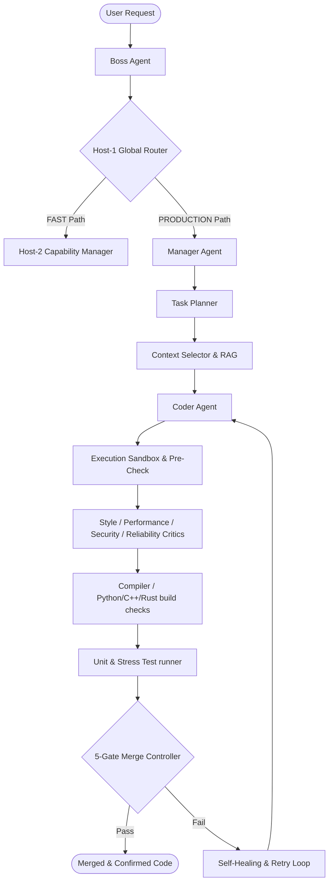

# ⚡ Zymis

[](https://pypi.org/project/zymis/)
[](https://opensource.org/licenses/Apache-2.0)
[](https://github.com/abhinav00anand/aiswarm/actions)

```text
  _____           _     
 |__  /_   _ _ __ (_)___ 
   / /| | | | '_ \| / __|
  / /_| |_| | | | | \__ \
 /____|\__, |_| |_|_|___/
       |___/             
```

> **The Autonomous, Safeguarded Swarm Orchestra for Software Engineering.**
>
> Zymis is a usable, lightweight, and modular multi-agent orchestration framework designed to plan, code, review, compile, and validate software within sandboxed boundaries.

---

## 🎭 The Orchestra Architecture

Zymis organizes AI agents into a structured hierarchical pipeline where every agent plays a distinct instrument:



---

## 🚀 Key Orchestral Features

*   **Host-1 Global Router**: Smart task routing with multiple execution paths:
    *   `FAST` lane (~0.1s latency) for trivial file operations or simple completions.
    *   `PRODUCTION` lane (12-stage Boss pipeline) for complex codebases and full swarms.
    *   `HYBRID` lane dynamically scaling based on task risk assessment.
*   **Execution Sandbox**: Subprocess code isolation with built-in path-traversal protection and restricted commands allowlisting (`python`, `pytest`, `git`, `pip`).
*   **Security Subsystem**:
    *   `APIKeyValidator`: Fail-fast startup checks.
    *   `SecretRedactor`: Filters API keys (OpenAI, Anthropic, Google, AWS, GitHub) from output logs.
    *   `EngineeringGovernor`: Spending limits, cost safeguards, and usage tracking.
    *   `AuditLedger`: Thread-safe, append-only logs kept locally in `~/.zymis/audit.jsonl`.
*   **5-Gate Merge Controller**: Strict automated validation checks on compilation, unit tests, code quality, and style before merging files.
*   **Rich Telemetry**: Built-in Prometheus metrics (`/metrics`) and OpenTelemetry-compatible tracing wrappers.

---

## 📦 Installation

Install Zymis from PyPI:

```bash
pip install zymis
```

To enable development dependencies:

```bash
pip install "zymis[dev]"
```

---

## 🛠️ Quick Start

### 1. Configure Credentials
Set your credentials in your shell or create a `.env` file in your workspace directory:

```bash
# Zymis API configuration
ZYMIS_API_KEY=your-zymis-key
OPENAI_API_KEY=your-openai-api-key
# Or use Anthropic, Google (Gemini), Bedrock, etc.
```

### 2. Command Line Interface (CLI)
Zymis includes a powerful command line tool to run swarms directly:

```bash
# Run a simple coding task in fast mode
zymis run "create a database schema for user profiles" --desc "Using SQLite and SQLAlchemy" --file models.py

# Cancel a running task
zymis cancel <task_id>

# Check active swarm task statuses
zymis status
```

### 3. FastAPI Web Server
Spin up the FastAPI integration server to interact with Zymis via REST API endpoints:

```bash
# Start the API server on port 8000
python -m apps.api.main
```

---

## ⚙️ Environment Variables

Customize the behavior of the Zymis engine:

| Variable | Description | Default |
| :--- | :--- | :--- |
| `ZYMIS_API_KEY` | Secret token to authenticate local execution clients. | None |
| `ZYMIS_NO_OLLAMA` | Disable local Ollama provisioning and model auto-pulls. | `0` |
| `ZYMIS_NOTEBOOK_MODE` | Enable lightweight notebook-friendly stdout stream formats. | `0` |
| `ZYMIS_AUDIT_LOG_PATH` | Override target folder for the local audit ledger. | `~/.zymis/audit.jsonl` |
| `ZYMIS_LOCAL_FIRST` | Prioritize local models or custom OpenAI-compatible adapters. | `0` |

---

## 👥 Contributing

Contributions are welcome! Please refer to the [Contributing Guide](CONTRIBUTING.md) and adhere to the [Code of Conduct](CODE_OF_CONDUCT.md).

## 📄 License

Licensed under the Apache License, Version 2.0 (the "License"); you may not use this file except in compliance with the License. You may obtain a copy of the License at

[http://www.apache.org/licenses/LICENSE-2.0](http://www.apache.org/licenses/LICENSE-2.0)

For support, contact us at [indrohelpdesk@gmail.com](mailto:indrohelpdesk@gmail.com).
