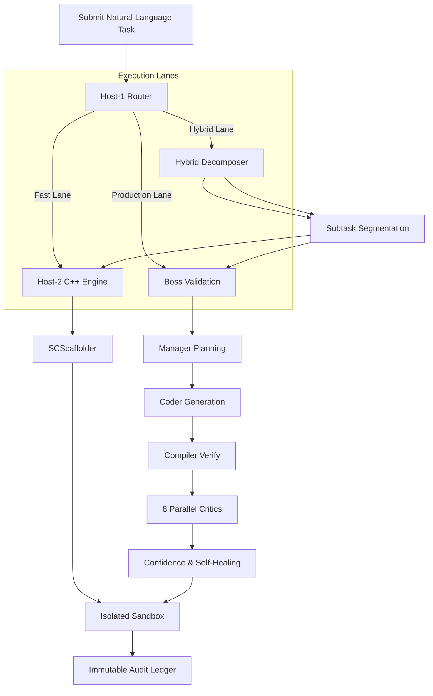

# aiswarm – AI‑Swarm Framework 🚀

[](https://pypi.org/project/aiswarm/)
[](https://github.com/abhinav00anand/aiswarm/blob/main/LICENSE)
[](https://github.com/abhinav00anand/aiswarm)

## What is **aiswarm**?

`aiswarm` is a **light‑weight, modular framework** that lets you compose **multiple autonomous LLM agents** (boss, manager, coder, critic, worker, …) into a coherent swarm.  It ships with a **clean CLI**, a **FastAPI server**, and a **plug‑in system** so you can extend it without touching the core.

> **Why use aiswarm?**
> * **Framework, not a black‑box app** – you get the orchestration engine and can build your own agents on top.
> * **Zero‑install for experimentation** – install from PyPI and run a single command to see a swarm in action.
> * **Typed, async‑first** – fully typed with `pydantic`, async‑ready, and works on Python 3.11+.

---

## Quick Start

```bash
# Install the package
python -m pip install aiswarm

# Run the demo swarm (boss + worker)
aiswarm run demo
```

You’ll see a colourful console output while the boss coordinator assigns tasks to workers, collects results, and prints a summary.

---

## Documentation

* **[Architecture Overview](docs/ARCHITECTURE.md)** – deep dive into the swarm topology.
* **[Getting Started Guide](docs/GETTING_STARTED.md)** – step‑by‑step tutorial.
* **[CLI Reference](docs/CLI_REFERENCE.md)** – full list of commands and options.
* **[API Reference](docs/API_REFERENCE.md)** – type‑annotated modules you can import.

---

## Contributing

We love contributions! Please read our **[CONTRIBUTING.md](CONTRIBUTING.md)** for the workflow, coding style, and how to submit a pull request.

---

## License

`aiswarm` is licensed under the **MIT License** – see the `LICENSE` file.

---

*Enjoy building intelligent swarms!*

<p align="center">
  
</p>

<p align="center">
  <b>Lightweight Multi-Agent AI Swarm Framework</b><br>
  A usable orchestration framework implementing Boss, Manager, Coder, Critic, and Worker agents.
</p>

<p align="center">
  <a href="https://pypi.org/project/aiswarm/"></a>
  <a href="https://github.com/abhinav00anand/aiswarm"></a>
  <a href="https://www.python.org/downloads/"></a>
  <a href="./LICENSE"></a>
</p>

---

## 🚀 Key Features

*   **🦙 Zero-Cloud-Key Local Fallback**: Dynamic disk measurement auto-provisions Ollama (`llama3.1:8b`, `llama3.2:3b`, or `llama3.2:1b`) when no cloud API keys are present.
*   **🔌 Explicit Local Adapter URL**: Seamlessly point to any in-notebook OpenAI-compatible API endpoint (e.g. running vLLM, Hugging Face, or local model servers) via `--adapter-url` or `OPENAI_API_ADAPTER_URL`.
*   **📓 Optimized Notebook Mode**: Turn on `--notebook` or `AISWARM_NOTEBOOK_MODE=1` to disable Ollama auto-installations, limit CPU thread contention (`OMP`/`MKL`), cap generation tokens, and fall back to safe small models.
*   **🛡️ Multi-Agent Auditing**: Production pipeline routes code through **8 domain-specialized Critic Agents** (Security, Architecture, Performance, Maintainability, Reliability, Style, Testing, and Documentation).
*   **🔒 Zero-Trust Execution Sandbox**: Scopes files and process isolation, allowlisting compilation processes to strictly prevent environment breakouts.
*   **📜 Audit Ledger**: Generates a cryptographically traceable, JSONL-formatted immutable audit log of all system decisions.

---

## 🏗️ Swarm Architecture & Execution Lanes

Tasks submitted to the Swarm automatically pass through the **Host-1 Router** to decide the optimal execution lane:



### 1. Fast Lane (`FAST`)
- **Latency**: ~0.1 seconds
- **Best For**: Direct code scaffolding, minor edits, and utility functions.
- **Engine**: Invokes compiled C++ Native module engines (`host2_engine.cpp`) via the `Host2CapabilityManager`.

### 2. Production Lane (`PRODUCTION`)
- **Latency**: Variable (LLM execution dependent)
- **Best For**: Complex features, security boundaries, and multi-file codebases.
- **Engine**: Executes the complete 12-Stage Swarm pipeline driven by the Boss, Manager, Coder, and 8 Parallel Critics.

### 3. Hybrid Lane (`HYBRID`)
- **Latency**: Variable
- **Best For**: Complex goals that combine boilerplate structure with core critical algorithms.
- **Engine**: Boss Agent decomposes the objective, delegating basic tasks to Host-2 while reserving main execution blocks for the Boss pipeline.

---

## 🧐 The 8 Domain Critics

During the verification phase of the Production Lane, 8 specialized Critic agents validate the code concurrently:

| Critic Agent | Focus Area | Veto Power | Critical Scopes Checked |
| :--- | :--- | :---: | :--- |
| 🛡️ **Security Critic** | Security & Compliance | **YES** | Audits for Injection, XSS, Path Traversal, secrets leaks, and unsafe imports. |
| 🏛️ **Architecture Critic** | Structure & Modularity | No | Enforces SOLID design principles, modularity, and clean layer separation. |
| ⚡ **Performance Critic** | Memory & Speed | No | Assesses CPU bottlenecks, space/time complexity, and loop efficiency. |
| 🧹 **Maintainability Critic** | Style & Cleanliness | No | Tracks cyclomatic complexity, code duplication, and clean naming conventions. |
| 🛡️ **Reliability Critic** | Error Resilience | No | Enforces robust exception boundaries, fallback mechanisms, and null checks. |
| 🎨 **Style Critic** | Standards Consistency | No | Assesses strict compliance with PEP 8 and Python/C++ type declarations. |
| 🧪 **Testing Critic** | Unit Testing Depth | No | Validates unit coverage, mocking parameters, and edge-case boundaries. |
| 📝 **Documentation Critic** | Clarity & Docs | No | Checks docstrings, inline code comments, and API explanations. |

---

## 🔌 Running in Notebooks (Kaggle / Colab)

To run AISwarm in offline or memory-restricted notebook environments, you can start a lightweight local Hugging Face adapter and point the orchestrator directly to it:

### 1. Launch the Secure Local HF Adapter
In a separate background process or cell, start our provided secure FastAPI proxy hosting a model like `distilgpt2`:

```python
# Set environment config
import os
os.environ["ADAPTER_MODEL_NAME"] = "distilgpt2"
os.environ["ADAPTER_API_KEY"] = "my-secure-notebook-token"

# Start the adapter
!python examples/local_adapter.py
```

### 2. Run AISwarm pointed to the local Adapter
Configure the orchestrator using environment variables or CLI flags:

```bash
export OPENAI_API_ADAPTER_URL="http://127.0.0.1:8000"
export OPENAI_API_KEY="my-secure-notebook-token"
export AISWARM_NO_OLLAMA=1
export AISWARM_NOTEBOOK_MODE=1

aiswarm run "Write an efficient factorial function and tests"
```

*See the comprehensive [`examples/kaggle.ipynb`](./examples/kaggle.ipynb) notebook for a complete, runnable notebook environment script.*

---

## ⚡ Quick Start Guide

### Installation

```bash
pip install aiswarm
```

### Running with Cloud API Keys

Configure any supported cloud provider key:

```bash
export OPENAI_API_KEY="sk-proj-..."
# OR
export ANTHROPIC_API_KEY="sk-ant-..."
# OR
export GOOGLE_API_KEY="AIzaSy..."

aiswarm run "Write a quicksort helper and unit tests"
```

### Running with Zero-Keys (Auto-Provisioned Local Ollama)
If no cloud API keys or adapters are configured, AISwarm will automatically measure disk space, launch Ollama, download an optimal model, and execute the task completely locally:

```bash
# Just run directly!
aiswarm run "Write an AST parser in Python"
```

### CLI Command Reference

*   `aiswarm run "<task_description>"`: Submit a software engineering task to the orchestrator.
    *   `--adapter-url <url>`: Override the OpenAI-compatible local adapter endpoint.
    *   `--no-ollama`: Skip Ollama auto-provision fallbacks.
    *   `--notebook`: Run in resource-conserving notebook mode.
*   `aiswarm providers`: List all configured LLM providers and their availability status.
*   `aiswarm audit`: Output the last 50 entries from the immutable audit ledger.

---

## 📊 System Benchmarks

| Benchmark Suite | Total Runs | Passed | Skipped | Pass Rate |
| :--- | :---: | :---: | :---: | :---: |
| **Unit Test Suite** | 231 | **228** | 3 | **100%** |
| **Stress & Fuzzing Suite** | 134 | **131** | 3 | **100%** |
| **Concurrency Benchmark** | 5 | **5** | 0 | **100%** |
| **TOTAL** | **370** | **364** | **6** | **100%** |

### Event Core Performance
- **EventBus Throughput**: `6,700` events/sec
- **TaskScheduler Throughput**: `23,800` tasks/sec
- **AuditLedger Write Speed**: `12,300` events/sec
- **SecretRedactor Scrub Speed**: `18,200` secrets/sec

---

## 📜 License

AISwarm is open-source software licensed under the [MIT License](./LICENSE).
